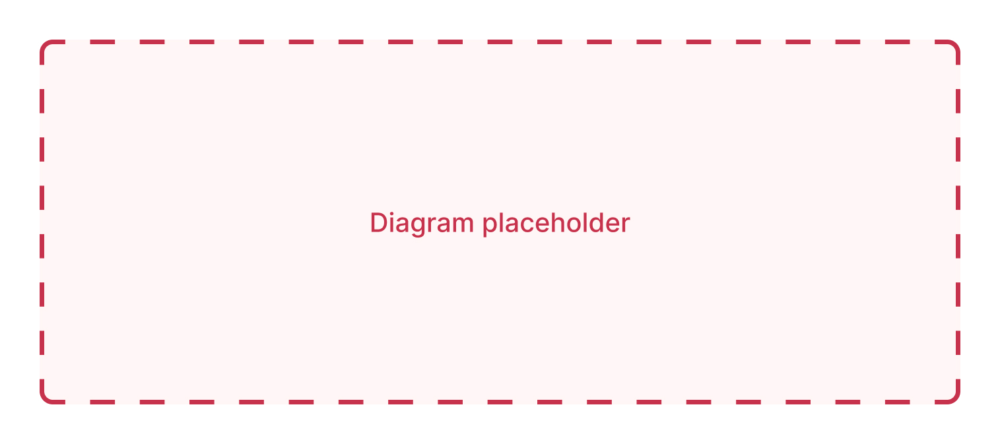

# Hardly Piano — Backend

This document describes the Hardly Piano backend in more detail.

Modules covered: **SE_22 Web Backend Technologies**

The development team comprises of Paul Ebert and Irakli Goderdzishvili. Both contributed to the development of the backend, and divided some responsibilities.

| Topic                        | Team member | Example commits |
| ---------------------------- | ----------- | --------------- |
| UserService, PieceService    | Irakli      |                 |
| AuthService, PracticeService | Paul        |                 |
| Integration and deployment   | Paul        |                 |
| Testing infrastructure       | Irakli      |                 |
| Refactoring                  | Both        |                 |
| Middleware, error-handling   | Irakli      |                 |
| Security measures            | Both        |                 |

---

## Overview

The backend comprises of a very common Node.js + Express.js + MongoDB tech stack, which serves data to an iOS app (with a Vue.js front-end planned for the future).

The architecture is currently **monolithic**. The amount of features, the expected traffic, and the current development team is quite small, so there is currently no need for significant scaling or maintainability measures like SOA or microservice architecture.

**Node:** We chose Node.js as the foundation of our backend because it’s lightweight, well-documented, easy to use, offers a large selection of packages, and uses JavaScript, a language we are both familiar with.

**Express:** We chose Express as our backend framework for building RESTful APIs. It is an industry standard, relatively easy to set up, and provides a streamlined way of creating REST endpoints.

**MongoDB:** We decided to select a NoSQL database over a relational database, due to our relatively simple schemas. MongoDB was the database of choice, as it is non-relational, works with JSON-formatted documents, is well-documented, is commonly used with Node+Express tech stacks, and offers its own free hosting.

**Mongoose:** We used the ODM library Mongoose to enforce schemas and used its APIs to connect to, and communicate with, our MongoDB Atlas instance.

_See also: [Database documentation](./Database.md)_

---

## Getting started

To start the server, enrivonment variables need to be provided in the `.env` file in the root directory. Additional variables are needed for connecting to the production database.

```bash
PORT=3000
MONGODB_USERNAME={mongo-username}
MONGODB_PASSWORD={mongo-password}
MONGODB_URI={mongodb-uri}
TOKEN_SECRET={jwt-token-secret}
```

#### Running a development server

```bash
# starts a server, connects to staging database and watches for file changes
npm run dev
```

#### Running a production server

```bash
# starts a production server and connects to the production database
npm run prod
```

#### Running tests

```bash
# test all files ending in '.test.js', using Jest
npm run test

# test specific files or directories
npm run test -- [filename | directory]
```

---

## Project structure



The server is broken down into multiple layers, each responsible for one aspect of the business logic. The four main layers are **routes, controllers, services** and **models.** This separation helps us write _and test_ different parts of the logic separately. Often, each layer is instantiated with their dependencies (e.g Models are passed into Services), which allows us to easily mock these dependencies and test each layer in isolation.

### Routes

The routes files define the different routes and endpoints of our application. Each file exports an instance of an Express router, as well as a `path` property. These are automatically imported by the custom `importRoutes` function in the `appUtils.js` file upon server start.

```js
// routes/users.js

const router = express.Router()
const path = "/users"
const isAuthenticated = require("../middleware/isAuthenticated")
const userController = require("../controllers/userController")

router.get("/", isAuthenticated, userController.get)
router.delete("/", isAuthenticated, userController.deleteAllUsers)
router.get("/all", userController.getAll)

module.exports = { path, router }
```

Each endpoint is defined with a particular method of an appropriate controller which will handle the request and send a response. Some routes import additional middleware, such as `isAuthenticated`, that are only supposed to be used in some endpoints.

### Controllers

The controllers, in other words "route handlers", handle the logic of processing HTTP requests, calls services to perform business logic, then sends an appropriate response.

```js
// controllers/userController.js
UserController.get = async (req, res) => {
    const user = await userService.getUserById(req.user._id)
    return res.status(200).send(user)
}
```

The controllers are responsible for the _flow_ and order of business logic (by calling services), but as a rule they perform as little business logic themselves as possible. They are also responsible for catching thrown Errors from Services and sending the errors in the HTTP response.

### Services

The services are responsible for performing the business logic, often read/writing from a database. These methods utilize Models (or other Services) to communicate with the database. Services do not interact with the `request` or `response` objects in any way.

```js
// services/userService.js
const User = require("../models/User")
UserService.getUserById = async (userId) => {
    if (!userId) throw new Error("No userId provided.")
    return await User.findById(userId)
}
```

### Models

The models define the _document schemas_ and return mongoose `Model` objects, which are able to read from and write to the MongoDB database, via methods like `.find()` and `.save()`.

```js
// models/User.js
const UserSchema = new mongoose.Schema({
    username: {
        type: String,
        required: true,
    },
    password: {
        type: String,
        required: true,
    },
    pieces: [Piece.schema],
})
const User = mongoose.model("User", UserSchema, collection)
```

Models use the document schemas to validate documents before saving/updating them, such as enforcing `required` fields or a `unique` constraint on usernames, but, as a general rule, custom validation is handle explicitly on the service level.

### Middleware

Alongside package-provided middleware such as `express.json()`, a view basic middleware functions are defined to parse requests or properly format responses. For instance, the `isAuthenticated` middleware checks the responses for JWT tokens, extracts a userID (if found), and passes it to the next handler.

```js
const isAuthenticated = (req, res, next) => {
    const jwt = require("jsonwebtoken")
    const token = req.header("Auth-Token")
    if (!token) return res.status(401).send("Access denied. No token provided.")

    try {
        const verified = jwt.verify(token, process.env.TOKEN_SECRET)
        req.user = verified
        next()
    } catch (e) {
        res.status(400).send("Access denied. Invalid token.")
    }
}
```

---

## Testing

### Database testing

Three database files are tested to ensure a proper connection with MongoDB.

-   `production-db.test.js` for connecting to production database
-   `development-db.test.js` for connecting to development database
-   `test-db.test.js` for connecting to a new, in-memory database instance

### Models

Model tests ensure that our Mongoose models are configured correctly, perform validation for required fields, and perform read/write calls to the database.

```js
// models/User.test.js
it("model User is successfully saved", async () => {
    const user = new User({
        username: "foo",
        password: "bar",
    })
    const saved = await user.save()
    expect(saved.username).toEqual(user.username)
    expect(saved.password).toEqual(user.password)
})
it("model User requires username and password", async () => {
    const user = new User({ username: "foo" })
    expect(await user.save).toThrow()
})
```

### Services

Service tests ensure that the methods of each service behave as expected. This includes all CRUD operations, error cases and custom validation logic.

```js
// pieceService.test.js.
it("is defined", () => {
    expect(PieceService.createPiece).toBeDefined()
})
it("doesn't create a piece with missing/invalid userId", async () => {
    expect(PieceService.createPiece(null)).toThrow()
})
```

Each service is instantiated with a `Model` object. This allows us to test with both the real Models, as well as Mock models.

### API tests

API tests ensure that our routes and controllers are working as expected. supertest is used to simulate HTTP requests, and the service modules are mocked using jest.mock(). Here, we test request parsing, response bodies and status codes, middleware and error-handling.

```js
// api.test.js
const request = require("supertest")

describe("/auth ---------------", () => {
    describe("POST /register", () => {
        it("successfully registers a user", async () => {
            const response = await request(app)
                .post("/auth/register")
                .send(user)
            expect(response.statusCode).toEqual(200)
            expect(response.body.data).toBeDefined()
        })
    })
})
```

---

## REST API


[🖼 Diagram of how a request flows from user to server and back]

Our REST API is comprised of a few routes and endpoints.

-   `/auth` — for authenticating users
-   `/users` — for user profiles and friends
-   `/pieces` — for getting and posting musical pieces
-   `/pieces/:id/practice` — for logging practice sessions

Visit the [API Documentation](#) for full details of each endpoint, and example requests/responses. The API documentation is created and hosted on Postman.

---
