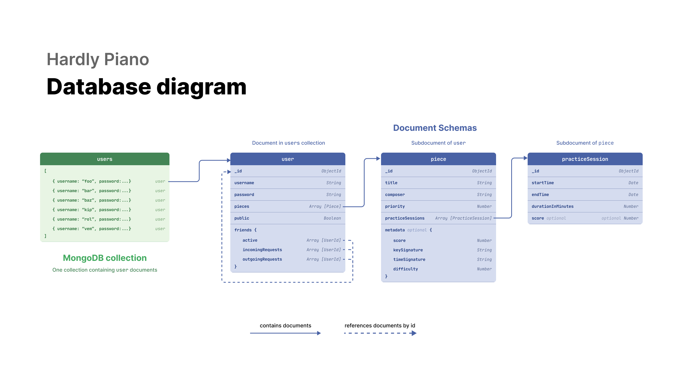

# Hardly Piano — Database

Overview of our database schemas, a database diagram, and reasoning behind decisions.

Related modules: **SE_06 NoSQL Databases**

---

## Relation vs NoSQL database

We picked a non-relational database over a relational database because of the data we planned to store. The app is going to be used by single users, who would store their own musical repertoire and practice sessions. The desired functionality didn't include any relations (although we later implemented one relation in the form of a friends list).

Additionally, non-relational databases are quite flexible and scale well horizontally. In particular, MongoDB (the database we ended up using) is easy to integrate into a Node + Express server, and allows us to query and return results in easy-to-use JSON format.

---

## Database model

Our database has one collection called `users` which currently contains all user data, including authentication. This collection contains `user` documents, which in turn have `piece` subdocuments. Pieces themselves have `practiceSession` subdocuments.

### user

-   `_id` (Mongoose ObjectId) — Unique and indexed.
-   `username` (string) — Unique and indexed.
-   `password` (string) — Hashed passwords.
-   `pieces` [ piece ] — Array of `piece` subdocuments.
-   `friends`
    -   `active` [ userId ] — reference by id to other user documents
    -   `incomingRequests` [ userId ]
    -   `outgoingRequests` [ userId ]

### piece

-   `_id` (Mongoose ObjectId) - Unique and indexed
-   `title` (String)
-   `composer` (String)
-   `practiceSessions` [ practiceSession ]
-   `metadata` (optional object)
    -   `score` (Number) — score based on total practice time
    -   `keySignature` (String)
    -   `timeSignature` (String)
    -   `difficulty` (Number)
-   `priority` (Number) — score of how important it is to practice
-   `totalPracticeMinutes` (Number)

### practiceSession

-   `_id` (Mongoose ObjectId) - Unique and indexed
-   `startTime` (Date)
-   `endTime` (Date)
-   `durationInMinutes` (Number)
-   `score` - self-assessment

---

## Considerations

There are some considerations we made about the way our database was designed. One was to have `piece` documents exist in their own `pieces` collection, which user objects would only reference by ID. This would allow all pieces to be available in one collection. On the other hand, the primary use case was for users to view their own pieces, and that would have required an additional query.

Another consideration was what to index. By default, MongoDB `_id` is the only indexed field. We also added an index to the `username`, which would increase query speed when searching for a user (to add as a friend).

---

## Mongoose as ODM

We use Mongoose as our ODM library. Mongoose allows us to define _and enforce_ the schemas above, perform validation on types and required fields, and additionally provides an API to connect to our MongoDB database on Atlas.

## Database hosting

We do not host the database manually. Instead, we use [MongoDB Atlas](https://www.mongodb.com/cloud/atlas/register), which offers a free plan for hosting one cluster of a MongoDB database. It also provides user- and IP-address-based access control, security, and backup features.
